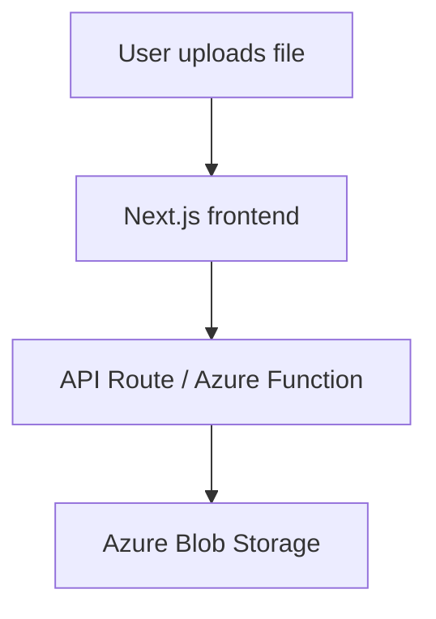

# Azure Storage Options for Next.js

For a Next.js app on Microsoft Azure, the storage layer is usually **Azure Blob Storage**. The hosting layer is often **Azure Static Web Apps** or **Azure App Service**, while **Next.js API routes** or **Azure Functions** handle secure uploads. 

## 1. Azure storage options

Azure provides several storage types, each for a different purpose. The main ones are **Blob Storage** for unstructured files, **Files** for managed file shares, **Disk Storage** for VM-attached block storage, **Queue Storage** for messages, and **Table Storage** for simple NoSQL data. 

## 2. Recommended options for Next.js

For file uploads in Next.js, the best choice is **Azure Blob Storage** because it is designed for images, documents, videos, and other app files. Azure saves the file as an object rather than trying to interpret its contents. 

For secure upload handling, use **Next.js API routes** or **Azure Functions** so storage credentials stay on the server.

For deployment, use **Azure Static Web Apps** if your Next.js app is mostly static or hybrid and you want easy deployment.

 Use **Azure App Service** if your app needs more backend flexibility or custom server behavior. 

## 3. Diagram

```text
Azure Storage Options
├── Blob Storage → files, images, videos
├── Azure Files → shared folders / file shares
├── Disk Storage → VM/server disks
├── Queue Storage → messages between services
└── Table Storage → simple structured data

Next.js recommended setup
User → Next.js frontend → API Route / Azure Function → Azure Blob Storage
                               |
                               ├── Azure Static Web Apps (easy deployment)
                               └── Azure App Service (more backend flexibility)
```
 ## 4. Flowchart
 
