# GMC Site Access — Visual Architecture Guide

**Read this first.** Flows and mental models for understanding the system.
**Technical reference:** [2026-06-17-GMC-SITE-ACCESS-ARCHITECTURE-DESIGN.md](./2026-06-17-GMC-SITE-ACCESS-ARCHITECTURE-DESIGN.md)

> **Diagrams:** Light boxes, dark text and lines — readable in light and dark editors. Refresh preview after edits.

<!-- Mermaid: light nodes + dark text/lines — readable on light and dark editor backgrounds -->

## Part 1 — The mental model

**One sentence:** GMC staff process **visits** (engagements) for **people** (visitors/expatriates) through a **department pipeline**, backed by Azure.

**Think of it like a hospital patient file:**

```text
Person     = the human (reused when they return)
Engagement = one folder for this visit (new every time)
Documents  = papers clipped inside this folder (fresh every visit)
Workflow   = the folder moving desk to desk (Reception → Hospital → …)
```

The **Engagement** is the centre. Everything else hangs off it.

```text
                    Person ──────────────┐
              (many visits over years) │
                                       ▼
  StaffUser ──────────────►  ENGAGEMENT  ──────► Documents
  (acts on)                  (one visit)  ──────► Stakeholder approvals
                                       │  ──────► Workflow states
                                       └──────► Audit log
```

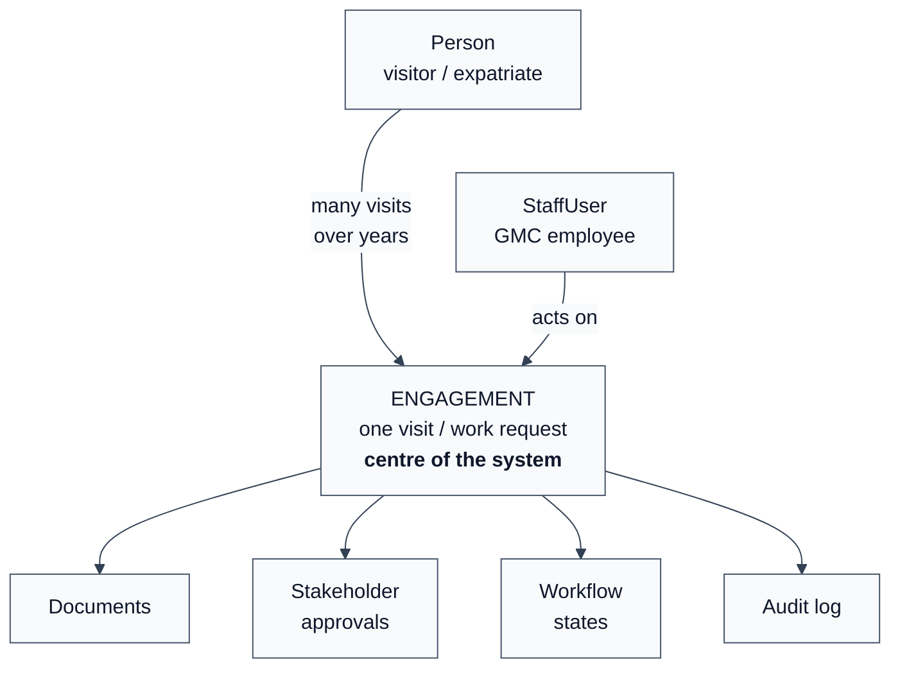

---

## Part 2 — The cast

### Visitors vs staff

| | Person | StaffUser |
|---|---|---|
| **Who** | Visitor / expatriate | GMC employee |
| **Logs in?** | No | Yes (Entra ID + PIN) |
| **Example** | Kwame the contractor | Receptionist Jane |

### Starting a new visit (Person lookup)

Receptionist **types** passport number. System does **not** read the scan automatically.

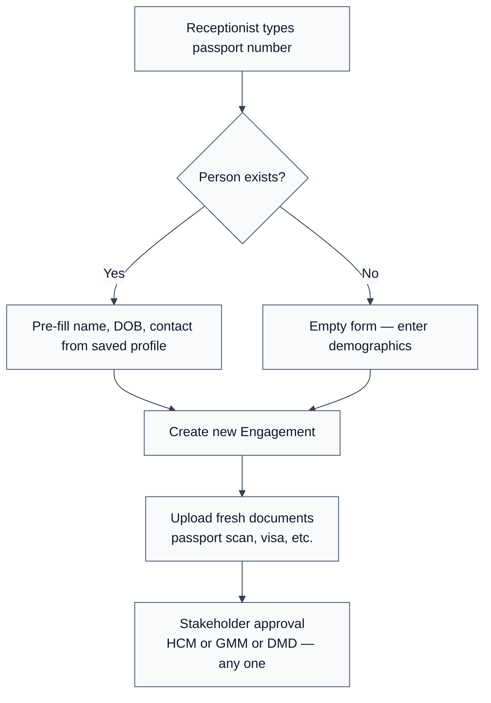

**Remember:** passport **number** = lookup key. Passport **scan** = evidence document only.

### What lives on an Engagement

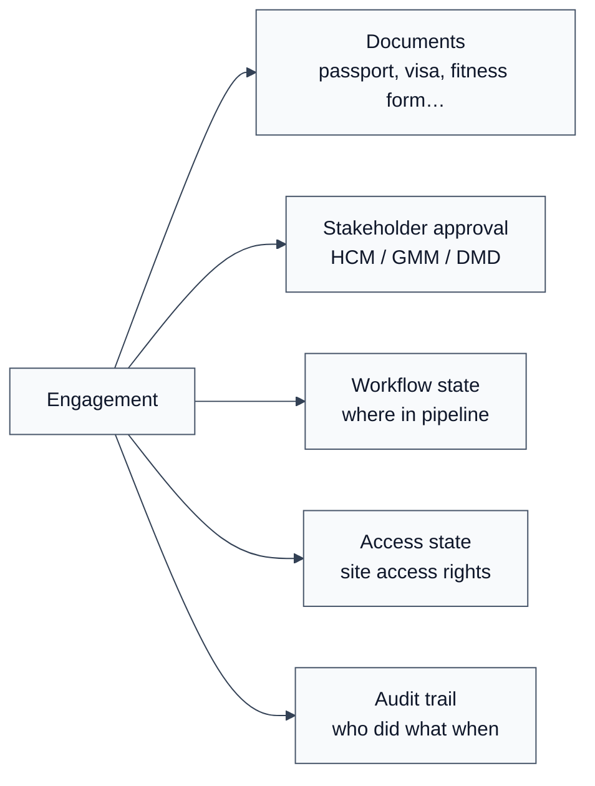

---

## Part 3 — The happy paths

Three paths are chosen at Reception.

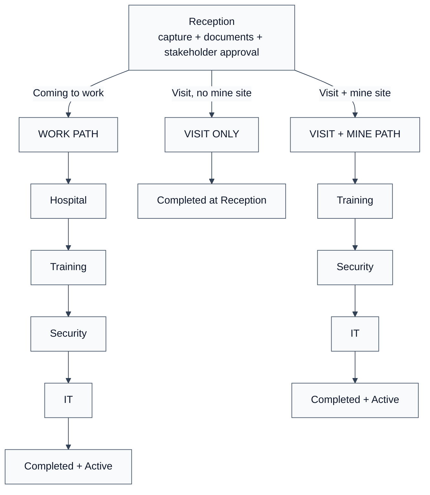

### Work path — step by step

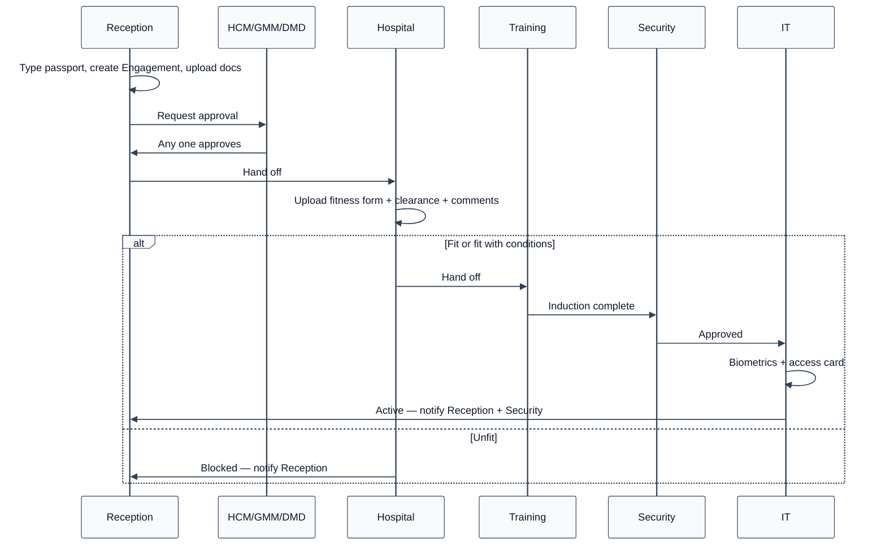

### Two lifecycles on the same Engagement

Don't mix these up — they run in parallel:

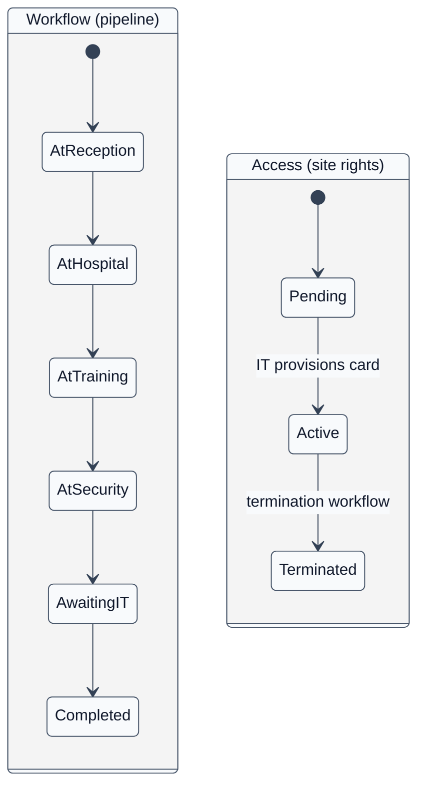

**Example:** After IT finishes → `Workflow = Completed` and `Access = Active`. Person can be on site for months while workflow stays completed.

---

## Part 4 — When things go wrong

### Visa / permit expires

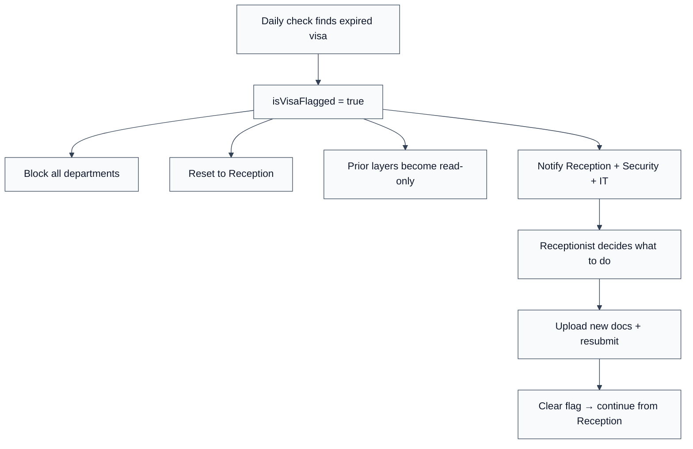

**Policy:** Access card never outlasts visa. Extension = new Engagement later, not patching the old one.

### Hospital — unfit

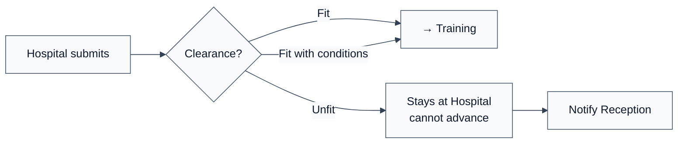

Hospital must upload **fitness form** + status + doctor comments before any outcome.

### Hospital clearance times out (3 months at Training)

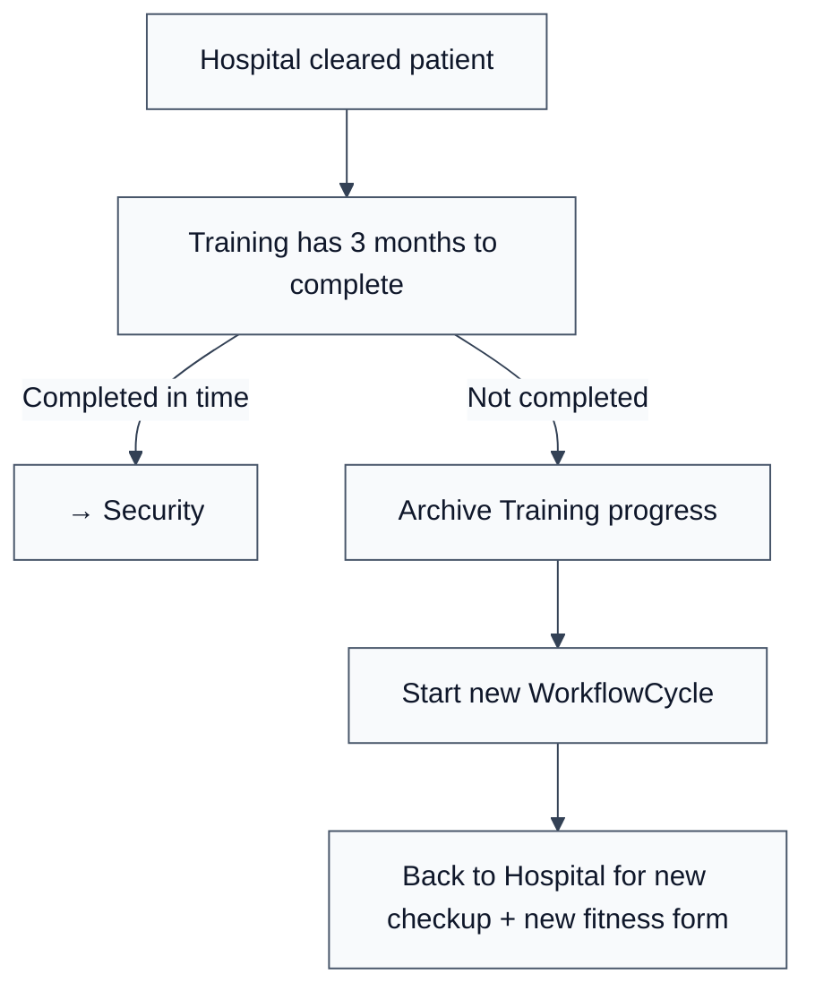

---

## Part 5 — Under the hood

### What staff see vs what runs in Azure

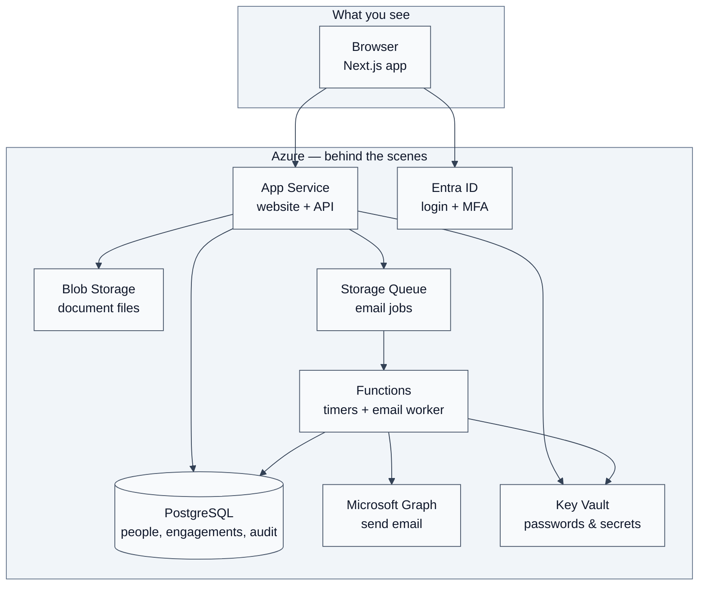

### Logging in (four gates)

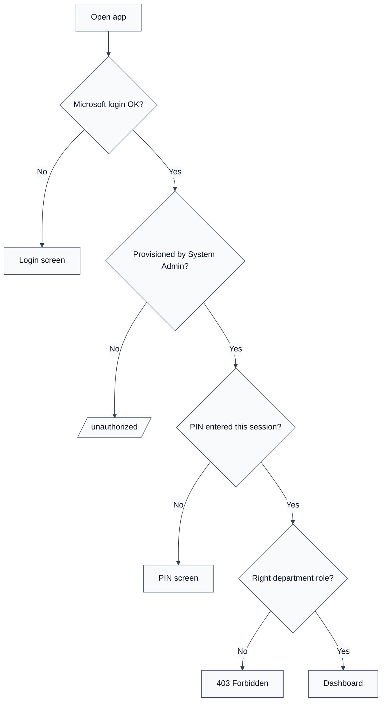

### Every click that moves a case forward

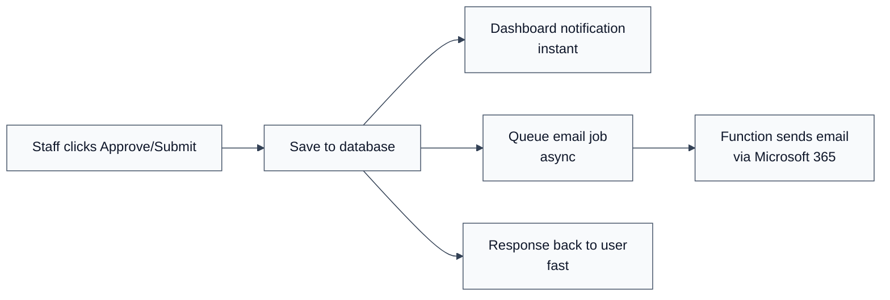

### Database security (Option A — your choice)

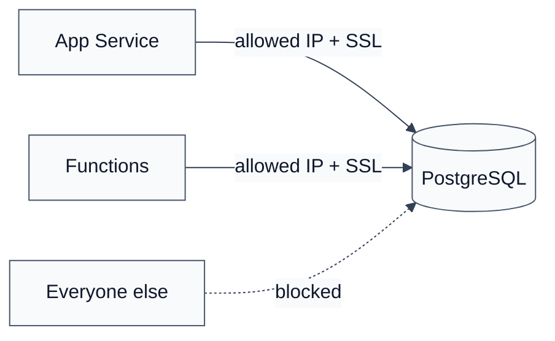

Not hidden — **firewalled**. Like a building on a street with a door that only opens for your servers.

### Background jobs (while you sleep)

| Job | When | What |
|---|---|---|
| `checkVisaExpiry` | Daily | Flag expired visas, reset to Reception |
| `checkHospitalTimeout` | Daily | 3-month Training timeout → back to Hospital |
| `sendEmail` | On queue message | Send queued emails via Graph |

---

## Part 6 — Who can do what

### System roles (app permissions)

| Role | Can do |
|---|---|
| **User** | Login only → sent to `/unauthorized` |
| **Guest** | View their department's queue (read-only) |
| **Admin** | View + act at their department |
| **System Admin** | Manage users, reset PINs, approve terminations |

### Workflow roles (which desk)

`Receptionist` · `Hospital` · `TrainingSchool` · `Security` · `IT` · `HCM` · `GMM` · `DMD`

One person can hold multiple workflow roles. Dashboard shows queues for their role(s).

### Before any action is allowed

```text
✓ Admin (not Guest)
✓ Not visa-flagged
✓ Case is at your department's step
✓ Previous department finished
✓ Required fields + documents present
```

---

## Part 7 — Shipping code

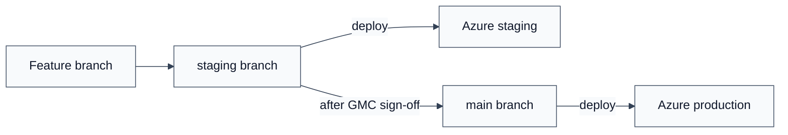

| Branch | Environment |
|---|---|
| `staging` | Staging |
| `main` | Production |

---

## Quick reference card

```text
Person       → who (reused)
Engagement   → this visit (new each time)
Document     → file for this visit (fresh each time)
StaffUser    → GMC employee using the app

Work path    → Reception → Hospital → Training → Security → IT
Visit only   → Reception only
Visit + mine → Reception → Training → Security → IT

Visa expires → flag, block, back to Reception
Hospital unfit → stuck at Hospital
3-month rule → back to Hospital, new cycle

Azure        → App Service + PostgreSQL + Blob + Functions + Graph + Entra ID
```

---

## Related docs

- [Technical design spec](./2026-06-17-GMC-SITE-ACCESS-ARCHITECTURE-DESIGN.md) — entities, SKUs, rules tables
- [Architecture audit](./2026-06-17-GMC-SITE-ACCESS-ARCHITECTURE-AUDIT.md) — review findings
- [SRS](../../SOFTWARE_REQUIREMENT_SPECIFICATION.md) — full requirements
- [Project overview](../../PROJECT_OVERVIEW.md) — business context
